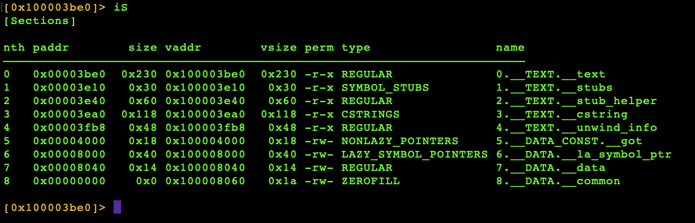

This is the first project where there is a mock os via terminal.

0. Intent:
    The intent is to uncover the password from the program using the executable (binary/a.out).

1. Memory management breakdown and logic therefrom:
    The program is relatively safe in memory with regard to segmentation (access of memory by the user in regions where the user has no permission/privileges, think ROM), memory leaks (failure to release dynamically allocated memory (heap memory) with free()), and buffer overflows (writing more data to a buffer than permissible). 
    
    There is no usage of heap memory. The memory allocated is static and stack and any user input requested goes to statically allocated buffers (fgets()).

2. Risk analysis of program based on myriad of considerations:
    The program is relatively safe. The only concern here is reading the executable file after its dissassembly.

3. Fun stuff regarding tools to use:
    The tool for exploration is Radare2.

4. Methodology to reverse:
    1. Use radare2

    2. Dissasseble the binary, then see if we can find the password by three methods:
    - Find the null terminator located at the end of strings and automatically given at any string input in a program.
    - Find all strings manually and question whether they might be what is being sought.
    - Seek all the sections/segments of memory, perhaps it is in the static allocation part of the memory.

    3. Find password through the method of seeking the data sections/segments, thereafter deducing the password from what is discovered in this search.

    The first thing to do is use your terminal, once you have downloaded radare2, and type in your terminal in the appropriate directory. In our case, our binary is called a.out:

    r2 a.out

    The second thing we will do is look for all the sections/segments of memory with the command iS. Type in your terminal iS. Your screen should look like this:

5. Conclusion as to what made the program safe and what made it unsafe from the outset, as well as what was learned:

