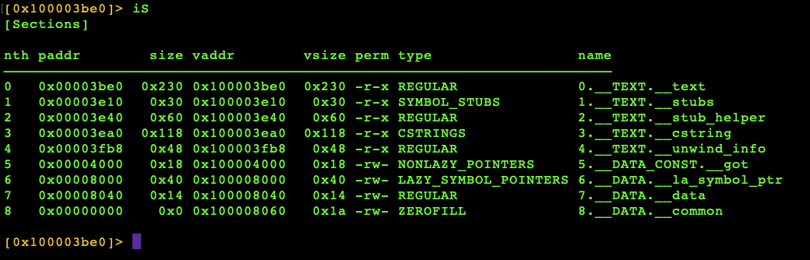

This is the first project where there is a mock os via terminal.

**********WORK IN PROGRESS**********

0. Intent:
    The intent is to uncover the password from the program using the executable (binary/a.out).

1. Memory management breakdown and logic therefrom:
    The program is relatively safe in memory with regard to segmentation (access of memory by the user in regions where the user has no permission/privileges, think ROM), memory leaks (failure to release dynamically allocated memory (heap memory) with free()), and buffer overflows (writing more data to a buffer than permissible). 
    
    There is no usage of heap memory. The memory allocated is static and stack and any user input requested goes to statically allocated buffers (fgets()).

2. Risk analysis of program based on myriad of considerations:
    The program is relatively safe. The only concern here is reading the executable file after its dissassembly.

3. Fun stuff regarding tools to use:
    The tool for exploration is Radare2.

4. Methodology to reverse:

a. Use radare2

b. Dissasseble the binary, then see if we can find the password by three methods:
- Find the null terminator located at the end of strings and automatically given at any string input in a program.
- Find all strings manually and question whether they might be what is being sought.
- Seek all the sections/segments of memory, perhaps it is in the static allocation part of the memory.

c. Find password through the method of seeking the data sections/segments, thereafter deducing the password from what is discovered in this search.

ACTUAL REVERSE PROCESS:

The first thing to do is use your terminal, once you have downloaded radare2, and type in your terminal in the appropriate directory. In our case, our binary is called a.out:

    r2 a.out

The second thing we will do is look for all the sections/segments of memory with the command iS. Type in your terminal iS. Your screen should look like this:

The screen displays the following from left to right:
- nth = An index of each item in memory
- paddr = The padding address, meaning the offset of memory based on RSP, base pointer which delineates the top of the stack.
- size = The size of the section of memory in the index
-  vaddr = The actual address of the section of memory in the index;where the memory is loaded
- vsize = The actual size of memory allocated for the object
- perm = permission: -r means read; x executable;rw means read write; w means write; - means permission is not set.
- type = These are categories of different sections in the memory. They are dustinguished by how they are allocated (heap, stack, static) and whether they are RODATA (read only data).

We are interested in static allocations because the password is likely stored there. So far as the program is concerned and for the sake of this exercise, let us pretend we don't have the source code (hence, the dissassembly of the binary).

In which case, since we only have the a.out file, we can excute the program through the terminal, at which point there is a prompt for the password. 

We don't know the password, but we have the deassembled text. Now, it is likely that the password is located in some form of static allocation. Remember our layout of memory sections up top, it is likely that there is a symbol that can lead us to the password. Our assumptions are the following:
- The password is located in static allocated memory.
- The password is contained in a symbol by name of password, or something like it.
- The passwrord can be found by locating all the symbols deassembled and listed using Radare2.

Now, if all of our assumptions are corrent, we have what we are looking for.

We will use the following command: 

Our command of choice is: is

is: a command to list symbols of the selected binary.

Thus, we have the address of the location and its offset space. The actual sice of the object is in the columun vaddr.

To dismiss assumptions would be a huge mistake. It turns out some of our assumtions have been verified: 
- There is a symbol named _password.
- There is a symbol named _password located in global memory (static allocation).

Not too bad, eh? The guessing game aspect of reverse engineering is what makes the process fun becaus, as you ipmrove, so will your assumptions. This is computer science.

The next question is how, instead of reading the assembly line by line, we can find the password using only commands from radare2 using the valid information we now possess?

5. Conclusion as to what made the program safe and what made it unsafe from the outset, as well as what was learned:

